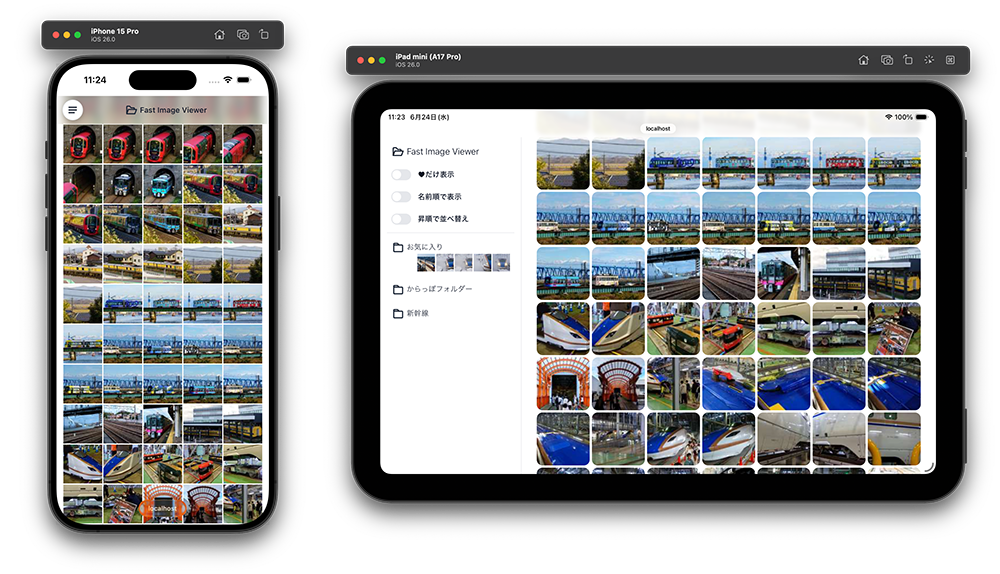

# fast-image-viewer

サーバ内の画像データフォルダを閲覧するWebアプリケーションです。以下の要素技術の練習用に作りました。

- バックエンド
  - [Django](https://www.djangoproject.com/)
  - [Django REST framework](https://www.django-rest-framework.org/)
  - [h5py](https://www.h5py.org/)
  - sqlite
- フロントエンド
  - [Vite](https://vite.dev/)
  - [Vue](https://vuejs.org/)
  - [Tailwind CSS](https://tailwindcss.com/) + [Flowbite](https://flowbite.com/)
- Docker



## 目次

- [fast-image-viewer](#fast-image-viewer)
  - [目次](#目次)
  - [使い方](#使い方)
    - [環境変数の準備とコンテナイメージのビルド](#環境変数の準備とコンテナイメージのビルド)
    - [画像データのスキャン](#画像データのスキャン)
    - [アプリの起動](#アプリの起動)
    - [アプリの停止](#アプリの停止)
    - [データベース・サムネイル画像ファイルの削除](#データベースサムネイル画像ファイルの削除)
  - [ライセンス](#ライセンス)

## 使い方

### 環境変数の準備とコンテナイメージのビルド

`.env.example`をコピーして`.env`を作り、設定値をカスタマイズしてください。

|環境変数名|値の説明|
|---|---|
|PROTOCOL|現状は`http`のみ指定可能|
|HOST|Webアプリを公開するホストのホスト名またはIPアドレス|
|PORT_WEB|Webアプリを公開するポート番号|
|PORT_API|WebアプリのAPIを公開するポート番号|
|DATASET_PATH|画像データを格納しているフォルダーのフルパス名|

`http://myserver.local:12345/`でWebアプリを公開する場合、以下のようになります。

```.env
PROTOCOL=http
HOST=myserver.local
PORT_WEB=12345
PORT_API=12346
DATASET_PATH=/path/to/dataset
```

以下のコマンドを実行して、コンテナイメージをビルドします。
`HOST`や`PORT_API`はコンテナイメージの中に格納されるため、これらの環境変数を変更したときはビルドをやり直します。

```bash
docker compose build
```

### 画像データのスキャン

すでにWebアプリケーションが起動している場合は、事前に[停止](#アプリの停止)しておいてください。

`docker-compose.yml`ファイルのあるフォルダーで以下のコマンドを実行してください。

```bash
docker compose run -i --rm app uv run manage.py migrate
docker compose run -i --rm app uv run manage.py scan_dataset
```

### アプリの起動

```bash
docker compose up -d
```

アプリ起動後、ブラウザで`http://{HOST}:{PORT_WEB}/`を開きます。

### アプリの停止

```bash
docker compose down
```

アプリ停止時に、アプリが作成したデータベースやサムネイル画像ファイルを消去したい場合は、以下のコマンドを実行してください。

```bash
docker compose down --volumes --rmi all
```

### データベース・サムネイル画像ファイルの削除

アプリの停止後、以下のコマンドを実行してください。

```bash
docker volume rm fast-image-viewer_appdata
```

## ライセンス

