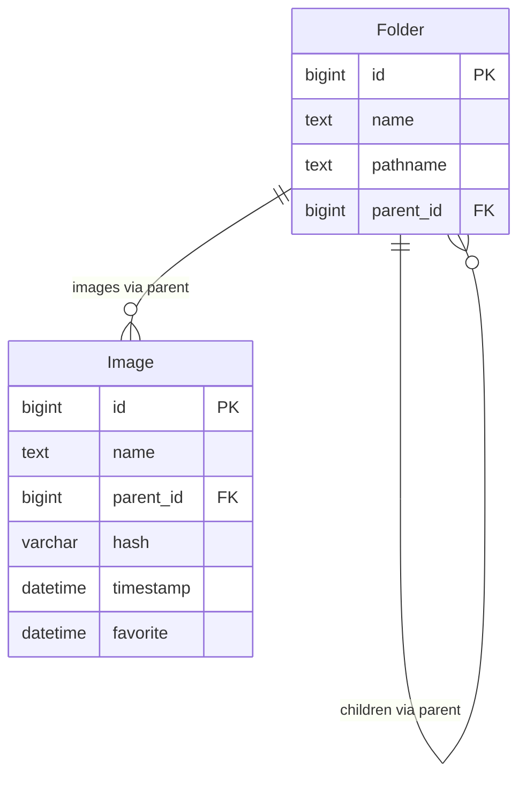

# データベース仕様

SQLAlchemy 2.0 で Django 既存スキーマと互換のテーブルを定義する。テーブル名は Django 既定の `api_folder` / `api_image` に固定し、既存 `dataset.sqlite3` をそのまま読み書きできるようにする。

## ER 関係

## テーブル定義

### `api_folder`

| 列 | 型 | 制約 | 説明 |
|---|---|---|---|
| id | BIGINT | PK, autoincrement | |
| name | TEXT | NOT NULL | フォルダ名 |
| pathname | TEXT | NOT NULL | データセットルートからの相対パス（例: `新幹線/W7系`） |
| parent_id | BIGINT | FK → `api_folder.id`, NULL 可, ON DELETE CASCADE | 親フォルダ。ルートは NULL |

- ユニーク制約・インデックスは Django 版と同様に設けない
- `pathname` でスキャン時の lookup を行う

### `api_image`

| 列 | 型 | 制約 | 説明 |
|---|---|---|---|
| id | BIGINT | PK, autoincrement | |
| name | TEXT | NOT NULL | ファイル名 |
| parent_id | BIGINT | FK → `api_folder.id`, NULL 可, ON DELETE CASCADE | 親フォルダ。ルート直下は NULL |
| hash | VARCHAR(16) | NOT NULL | `imagehash.average_hash` の hex 文字列 |
| timestamp | DATETIME | NOT NULL | ファイル mtime（TZ 付き想定） |
| favorite | DATETIME | NULL 可 | お気に入り登録日時。未登録は NULL |

- 実ファイルは DB に持たない。パスは `FIV_DATASET_FOLDER_PATH` + `parent.pathname` + `name` から解決する
- サムネイルは HDF5 側（キー = Image `id` の文字列）。詳細は [`dataset.md`](./dataset.md)

## SQLAlchemy 実装上の注意

- `__tablename__` を `"api_folder"` / `"api_image"` に明示する
- `Image.hash` は Python 予約語回避のため属性名 `hash_` + `mapped_column("hash", ...)` とする（JSON レスポンスのキーは `hash`）
- FK の `ondelete="CASCADE"` を SQLAlchemy / Alembic 双方で再現する

## マイグレーション（Alembic）

- 初期リビジョンは Django `0001_initial` と同等のスキーマを作る
- **新規 DB**: `uv run alembic upgrade head`
- **既存 Django DB**（テーブル済み）: スキーマ変更はせず `uv run alembic stamp head` で履歴のみ揃える

## 認証・セッション

アプリレベルの認証は行わない。SQLite への接続はプロセス内セッション（FastAPI の `Depends`）で行う。
