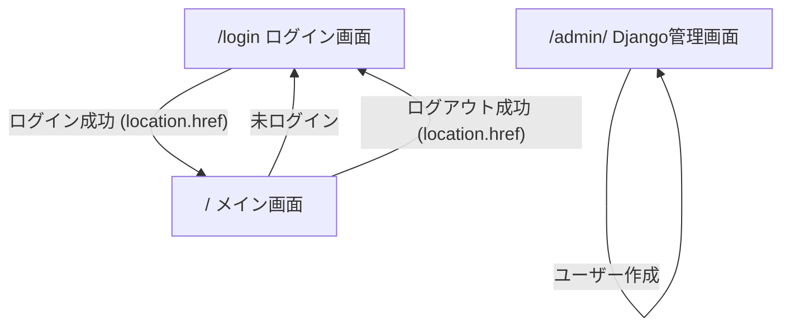

# ログイン・ログアウト機能

## 概要

`fast-image-viewer` はフロントエンド（Vue SPA）とバックエンド（Django REST framework）が分離した構成である。認証は **Django 標準の `django.contrib.auth`** を使い、セッション Cookie によってログイン状態を維持する。

ユーザー登録はフロントエンドでは行わない。Django の管理画面（`/admin/`）で管理者がユーザーを作成する。

## 技術スタック

| 層 | 技術 |
|---|---|
| 認証 | `django.contrib.auth` |
| API | Django REST framework（DRF） |
| 認証クラス | `rest_framework.authentication.SessionAuthentication` |
| フロントエンド | Vue 3 + Vue Router + `fetch` API |
| クロスオリジン | `django-cors-headers`（`CORS_ALLOW_CREDENTIALS = True`） |

## 画面遷移



## ユーザー管理

- ユーザーモデルは `django.contrib.auth.models.User`（カスタム User モデルは使わない）
- 初回セットアップ時に `createsuperuser` で管理者を作成する
- 一般ユーザーは Django 管理画面（`http://{HOST}:{PORT_API}/admin`）で作成する
- フロントエンドにユーザー登録画面（`/register`）は設けない

## バックエンド仕様

### Django 設定（`backend/fast_image_viewer/settings.py`）

以下を設定する。

| 設定項目 | 値 | 説明 |
|---|---|---|
| `INSTALLED_APPS` | `django.contrib.auth`, `django.contrib.sessions` など | 標準認証アプリを有効化 |
| `MIDDLEWARE` | `SessionMiddleware`, `AuthenticationMiddleware` など | セッション・認証ミドルウェア |
| `REST_FRAMEWORK['DEFAULT_AUTHENTICATION_CLASSES']` | `SessionAuthentication` | DRF のセッション認証 |
| `CORS_ALLOW_CREDENTIALS` | `True` | クロスオリジンで Cookie を送受信 |
| `CORS_ALLOWED_ORIGINS` | フロントエンドのオリジン | 例: `http://localhost:5173` |
| `CSRF_TRUSTED_ORIGINS` | `CORS_ALLOWED_ORIGINS` と同じ | CSRF 保護付き POST を許可 |

セッション Cookie の有効期限は用途に応じて設定する。

- ブラウザ終了時に期限切れ: `SESSION_EXPIRE_AT_BROWSER_CLOSE = True`
- 永続 Cookie（例: 1年）: `SESSION_COOKIE_AGE = 60 * 60 * 24 * 365`, `SESSION_EXPIRE_AT_BROWSER_CLOSE = False`, `CSRF_COOKIE_AGE = SESSION_COOKIE_AGE`

### REST API エンドポイント

ベースパス: `/api/v1`

`FolderViewSet` と `ImageViewSet` には `permission_classes = [IsAuthenticated]` を設定し、未ログインのリクエストは拒否する（HTTP `403 Forbidden`）。

認証不要なエンドポイントは `session`（GET）、`login`（POST）、`logout`（POST）のみとする。

#### セッション確認

```http
GET /api/v1/session HTTP/1.1
Accept: application/json
Cookie: sessionid=...; csrftoken=...
```

| 条件 | HTTPステータス | レスポンス |
|---|---|---|
| ログイン中 | `200` | `{"id": 1, "username": "alice"}` |
| 未ログイン | `401` | `{"detail": "認証されていません。"}` |

- `@permission_classes([AllowAny])` を指定する（`DjangoModelPermissionsOrAnonReadOnly` が関数ビューに適用されないようにする）
- `@ensure_csrf_cookie` を指定し、未ログイン時でも CSRF Cookie を発行できるようにする

#### ログイン

```http
POST /api/v1/login HTTP/1.1
Content-Type: application/json
X-CSRFToken: ...
Cookie: csrftoken=...

{"username": "alice", "password": "secret"}
```

| 条件 | HTTPステータス | レスポンス |
|---|---|---|
| 成功 | `200` | `{"id": 1, "username": "alice"}` |
| ユーザー名またはパスワード未指定 | `400` | `{"detail": "ユーザー名とパスワードが必要です。"}` |
| 認証失敗 | `401` | `{"detail": "ログインに失敗しました。"}` |

実装:

- `django.contrib.auth.authenticate()` でユーザーを検証する
- `django.contrib.auth.login()` でセッションを確立する
- パスワードのハッシュ化は Django に任せる（自前実装しない）

#### ログアウト

```http
POST /api/v1/logout HTTP/1.1
X-CSRFToken: ...
Cookie: sessionid=...; csrftoken=...
```

| 条件 | HTTPステータス | レスポンス |
|---|---|---|
| 成功 | `200` | `{"detail": "ログアウトしました。"}` |

実装:

- `django.contrib.auth.logout()` でセッションを破棄する

### URL ルーティング（`backend/api/urls.py`）

```python
urlpatterns = [
    path('', include(router.urls)),
    path('session', views.session),
    path('login', views.login),
    path('logout', views.logout),
]
```

### 認証済みユーザーの取得

API 内でログイン中のユーザーを参照するヘルパー:

```python
def _get_session_user(request):
    if request.user.is_authenticated:
        return request.user
    return None
```

`request.session['user_id']` のような自前セッションキーは使わない。

## フロントエンド仕様

### ルーティング（`frontend/src/router/index.ts`）

| パス | コンポーネント | 説明 |
|---|---|---|
| `/login` | `LoginPage.vue` | ログインフォーム |
| `/` | `MainPage.vue` | メイン画面（要ログイン） |

### ログイン画面（`LoginPage.vue`）

- ユーザー名・パスワードの入力フォームを表示する
- 送信時に `POST /api/v1/login` を呼び出す
- 成功時は `location.href = router.resolve({ name: 'Main' }).href` で `/` へ **フルリロード** 遷移する
- 失敗時はエラーメッセージを表示する

フルリロードにする理由: Flowbite の Drawer コンポーネントが初回ページ読み込み時にのみ初期化されるため。

### メイン画面（`MainPage.vue`）

#### 認証ガード

- マウント時に `GET /api/v1/session` でセッションを確認する
- 未ログインなら `router.replace('/login')` へ遷移する
- ログイン中のみページ内容を表示する（`v-if="isAuthenticated"`）

#### ログアウト

- サイドバーにログイン中のユーザー名と「ログアウト」ボタンを表示する
- クリック時に `POST /api/v1/logout` を呼び出す
- 成功時は `location.href = router.resolve({ name: 'Login' }).href` で `/login` へ **フルリロード** 遷移する

フルリロードにする理由:

- Flowbite Drawer が `body` に追加したバックドロップ要素が SPA 遷移では残る
- Drawer のイベントリスナーが再初期化されない

#### アクセシビリティ（Flowbite Drawer 併用時）

- デスクトップ表示（768px 以上）では、Flowbite が付与する `aria-hidden` をサイドバーから除去する
- ログアウト前にフォーカスをサイドバー外へ移動する

### API ユーティリティ（`frontend/src/util.ts`）

| 関数 | 説明 |
|---|---|
| `getSession()` | `GET /api/v1/session` を呼び、`SessionUser \| null` を返す |
| `checkSession()` | `getSession()` の成否を `boolean` で返す |
| `postData()` | CSRF トークン付き POST（`credentials: 'include'`） |
| `ensureCsrfCookie()` | CSRF Cookie が無い場合、`GET /api/v1/session` で取得する |
| `getData()` / `patchData()` | すべて `credentials: 'include'` で Cookie を送信する |

CSRF トークンは Cookie の `csrftoken` から読み取り、`X-CSRFToken` ヘッダーに設定する。

### 環境変数（`frontend/.env`）

```
VITE_API_BASE_URL=http://localhost:8000
```

## セキュリティ上の注意

- パスワードは Django の PBKDF2 等でハッシュ化される（平文保存しない）
- POST リクエストには CSRF 保護を適用する
- ログイン・セッション確認 API は `@permission_classes([AllowAny])` とするが、認証の成否は各ビュー内で判定する
- セッション Cookie は `HttpOnly`（Django デフォルト）で JavaScript からは読めない

## 動作確認手順

1. `uv run manage.py createsuperuser` で管理者を作成
2. `/admin/` で一般ユーザーを作成
3. フロントエンド `/login` からログイン → `/` が表示される
4. サイドバーにユーザー名が表示される
5. ログアウト → `/login` へ遷移する
6. 未ログインで `/` にアクセス → `/login` へリダイレクトされる
